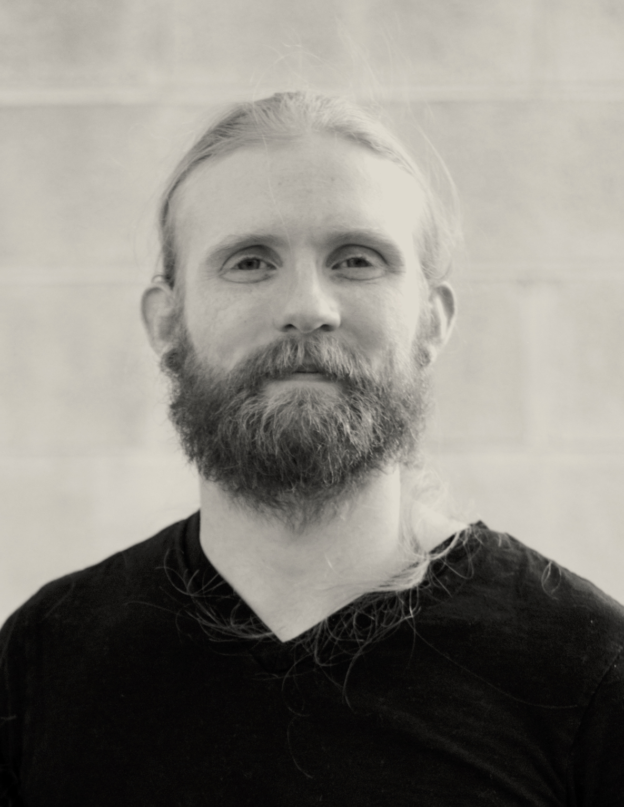

## Building great tools to enable great work.  
Tools are built to allow us to work faster, smarter, and easier. The best tools remove obstacles and allow us to focus on the problems that we're experts at solving.  

Computer graphics pipelines are filled with specialists of every kind, and building great tools for so many people requires the skills to listen and understand many needs and weigh them against one another. Most importantly building tools that are designed to change when workflows and needs change.  

Prototyping and iteration are core to my workflow. My first priority when presented with a new problem is to go around the cycle of create, present, and critique. This process provides context for making long term plans by laying bare the constraints of what "finished" really means.  

You can download my [resume here](resume.pdf) and you can find me on [github here](https://github.com/MichaelAldrich) and [linkedin here](https://www.linkedin.com/in/michaeljaldrich/)
